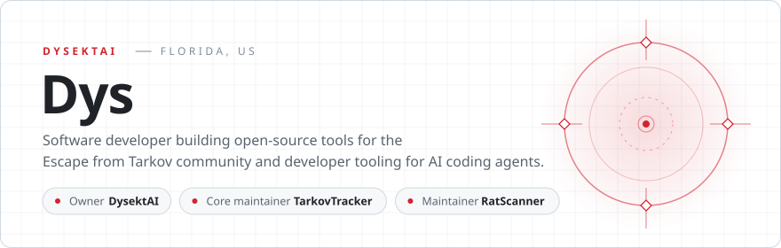
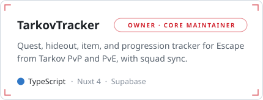
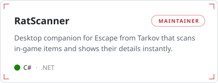
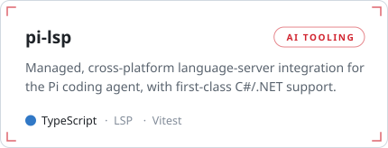
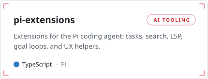
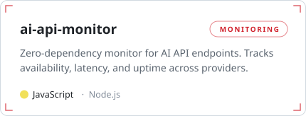
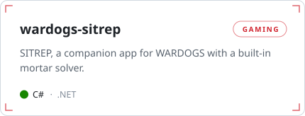
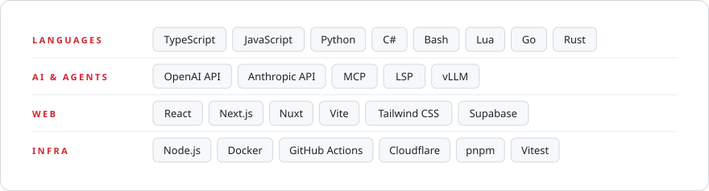

<picture>
  <source media="(prefers-color-scheme: dark)" srcset="./assets/header-dark.svg">
  
</picture>

  <a href="https://dysektai.com"><b>dysektai.com</b></a>
  &nbsp;&nbsp;·&nbsp;&nbsp;
  <a href="https://x.com/Dys_AI"><b>X / @Dys_AI</b></a>
  &nbsp;&nbsp;·&nbsp;&nbsp;
  <a href="https://discord.gg/tev8PAYJ83"><b>Discord</b></a>

### Maintaining

  <a href="https://github.com/tarkovtracker-org/TarkovTracker"><picture><source media="(prefers-color-scheme: dark)" srcset="./assets/cards/tarkovtracker-dark.svg"></picture></a>
  <a href="https://github.com/RatScanner/RatScanner"><picture><source media="(prefers-color-scheme: dark)" srcset="./assets/cards/ratscanner-dark.svg"></picture></a>

I also run the [tarkovtracker-org](https://github.com/tarkovtracker-org) organization, home to the [data overlay](https://github.com/tarkovtracker-org/tarkov-data-overlay), [TrackerBot](https://github.com/tarkovtracker-org/TrackerBot), and [RatScannerData](https://github.com/tarkovtracker-org/RatScannerData).

### Projects

  <a href="https://github.com/DysektAI/pi-lsp"><picture><source media="(prefers-color-scheme: dark)" srcset="./assets/cards/pi-lsp-dark.svg"></picture></a>
  <a href="https://github.com/DysektAI/pi-extensions"><picture><source media="(prefers-color-scheme: dark)" srcset="./assets/cards/pi-extensions-dark.svg"></picture></a>
  <a href="https://github.com/DysektAI/ai-api-monitor"><picture><source media="(prefers-color-scheme: dark)" srcset="./assets/cards/ai-api-monitor-dark.svg"></picture></a>
  <a href="https://github.com/DysektAI/wardogs-sitrep"><picture><source media="(prefers-color-scheme: dark)" srcset="./assets/cards/wardogs-sitrep-dark.svg"></picture></a>

Also contributing to [Tarkov.dev](https://github.com/the-hideout) (`tarkov-api`, `tarkov-dev`, `tarkov-data-manager`, `TarkovMonitor`) and maintaining forks of [discord-mcp](https://github.com/DysektAI/discord-mcp) and [pi-fork](https://github.com/DysektAI/pi-fork).

### Stack

<picture>
  <source media="(prefers-color-scheme: dark)" srcset="./assets/stack-dark.svg">
  
</picture>

### Activity

  

